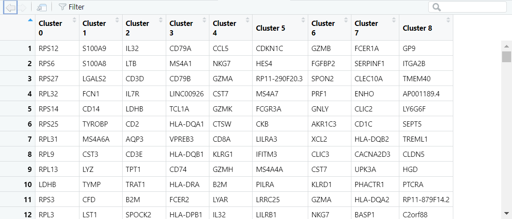
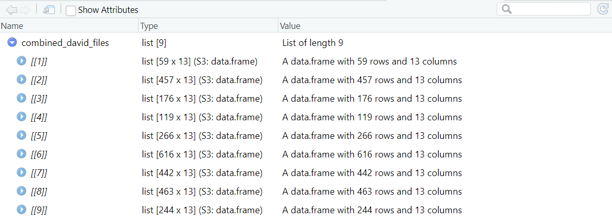
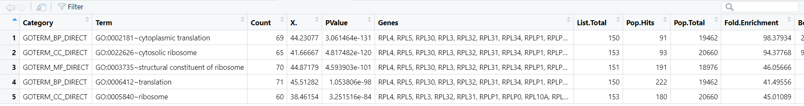
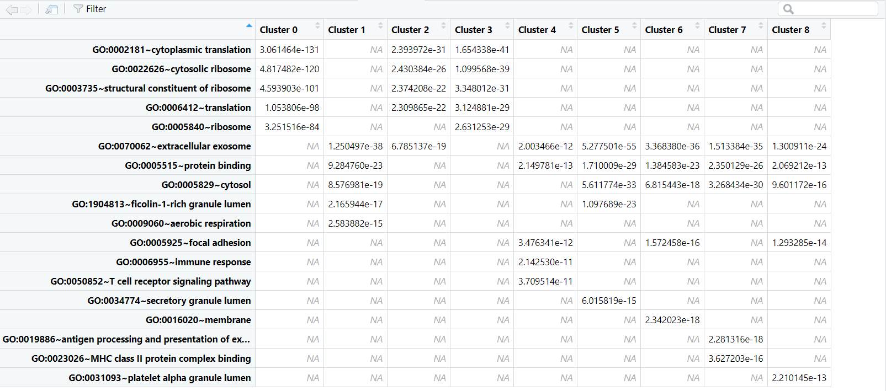
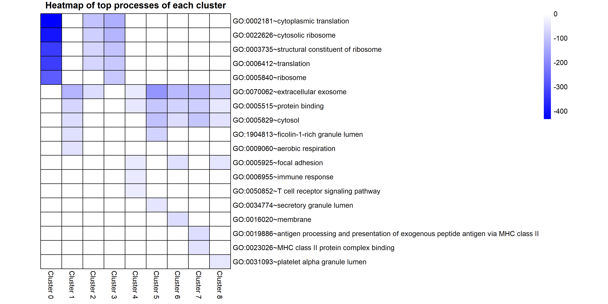

```{r, include = FALSE}
knitr::opts_chunk$set(
  collapse = TRUE,
  comment = "#>"
)
```

First, you need to load the package before using any of its functions. You also
need to install (if you have not) and load the package "magrittr".
```{r setup}
library(SeuratToGO)
library(magrittr)
```

In single-cell RNA sequencing (scRNA-seq), clusters are groups of cells that 
exhibit similar gene expression patterns. The primary goal of clustering in 
scRNA-seq analysis is to identify and group together cells that share similar transcriptional profiles. Each cluster represents a distinct population of cells
with potentially similar cell types, biological states, or functions.
An R pacakge called Seurat is a popular tool used to carry out the 
pre-processing, clustering and visualization steps in scRNA-seq analysis.

`pbmc_markers` is a data frame that contains the genes identified in each cluster 
and other associated values and is included in this package. It is produced by 
the FindAllMarkers() function in
the Seurat package. You can do generate this data by yourself by following the
tutorial on: https://satijalab.org/seurat/articles/pbmc3k_tutorial.html.
```{r}
# view the pbmc_markers file
head(SeuratToGO::pbmc_markers)

# separate the clusters
separated_df <- SeuratToGO::separate_clusters(SeuratToGO::pbmc_markers)

# run this line to view the data frame in a separate tab
# View(separated_df)
```

When you run `View(separated_df)`, you should see the image below in a separate
tab.

```{r, out.width = "700px", echo=FALSE}

```

After running `separate_clusters`, you will see a file called `genes_list.txt` 
in your current working directory. This file can be uploaded onto the [DAVID 
website](https://david.ncifcrf.gov/summary.jsp) for GO analysis, and the output 
can be downloaded as separate text files, one for each cluster.

In this tutorial, the DAVID output files are already included in the 
`inst/extdata` directory in the package, so it can be accessed with the
`system.file` function. However, when processing your own output files, you have
to provide the path to the folder. 

An example of a folder containing outputs files can be downloaded from [here](https://github.com/dien-n-nguyen/SeuratToGO/blob/master/inst/extdata/david.zip). 
```{r}
david_folder_path <- system.file("extdata", "david", package = "SeuratToGO")
david_combined <- SeuratToGO::combine_david_files(david_folder_path)
# david_combined <- combine_david_files("./david/")

# DAVID output columns for each cluster
colnames(david_combined[[1]])

# run this line to view david_combined list in a separate tab
# View(david_combined)
```

When you run `View(david_combined)`, you should see the image below in a 
separate tab.

```{r, out.width = "700px", echo=FALSE}

```

For further understanding of DAVID output files, you can access page 9 of the 
DAVID tutorial [here](https://david.ncifcrf.gov/helps/tutorial.pdf).
 
The `get_top_processes` function assumes that you have been processing data from 
cluster 0, 1, 2 ... to n, with no missing clusters, and these clusters are 
arranged in ordered in the `david_combined` list.

```{r}
# find the top 5 processes in cluster 0
cluster0_top5 <- SeuratToGO::get_top_processes(combined_list = david_combined,
                                               cluster = 0,
                                               benjamini = 0.05,
                                               top_n = 5)

# the different attributes associated with each process
colnames(cluster0_top5)

# run this line to view the top five clsuters in a separate tab
# View(cluster0_top5)
```

When you run `View(cluster0_top5)`, you should see the image below in a 
separate tab.

```{r, out.width = "700px", echo=FALSE}

```

To get all the top processes in each function into one data frame, we can use 
the `get_all_top_processes` function. Each row in the data frame is a process 
and each column is a cluster. Each cell contains the p-value of a process in a 
cluster. So, each column should have only 5 cells with values and the rest are 
NA.


The main different between the functions `get_all_top_processes` and 
`get_top_processes` is that the former shows only the p-values of the top 
processes of each cluster, while the latter shows the top processes of one
cluster in greater detail. 
```{r}
top_all <- SeuratToGO::get_all_top_processes(combined_list = david_combined,
                                             benjamini = 0.05,
                                             top_n = 5)
# run this line to view the top_all dataframe in a separate tab
# View(top_all)
```

When you run `View(top_all)`, you should see the image below in a separate tab.

```{r, out.width = "700px", echo=FALSE}

```

Finally, we can visualize the top processes using a simple heat map. The 
`top_processes_heatmap` function takes the log2 value of each P-value, so that 
variations are more distinguishable, since differences in P-values can be 
extremely small. 
```{r}
# this function automatically saves the plot to your working directory
# you can adjust width and height to fit the whole plot
top_plot <- SeuratToGO::top_processes_heatmap(top_processes_df = top_all,
                                              width = 12, 
                                              height = 6)

```

The resulting heat map looks like this!
```{r, out.width = "700px", echo=FALSE}

```

```{r}
sessionInfo()
```


### References
 - Bache S, Wickham H. 2022. magrittr: A Forward-Pipe Operator for R. https://magrittr.tidyverse.org, https://github.com/tidyverse/magrittr.

 - Benjamini Y, Hochberg Y. 1995. Controlling the False Discovery Rate: A Practical and Powerful Approach to Multiple Testing. *Journal of the Royal Statistical Society: Series B (Methodological*. 57(1):289–300. doi:10.1111/j.2517-6161.1995.tb02031.x.
   
 - Butler A, Hoffman P, Smibert P, Papalexi E, Satija R. 2018. Integrating single-cell transcriptomic data across different conditions, technologies, and species. *Nat Biotechnol*. 36(5):411–420. doi:10.1038/nbt.4096.

 - Kolde R. 2019. Pheatmap: pretty heatmaps. https://github.com/raivokolde/pheatmap
 
 - R Core Team. 2023. R: A language and environment for statistical computing. *R Foundation for Statistical Computing, Vienna, Austria.* https://www.R-project.org/

 - Sherman BT, Hao M, Qiu J, Jiao X, Baseler MW, Lane HC, Imamichi T, Chang W. 2022. DAVID: a web server for functional enrichment analysis and functional annotation of gene lists (2021 update). *Nucleic Acids Res.* 50(W1):W216–W221. doi:10.1093/nar/gkac194.

 - Stuart T, Butler A, Hoffman P, Hafemeister C, Papalexi E, Mauck WM, Hao Y, Stoeckius M, Smibert P, Satija R. 2019. Comprehensive Integration of Single-Cell Data. *Cell*. 177(7):1888-1902.e21. doi:10.1016/j.cell.2019.05.031.
 
 - Wickham H, Bryan, J. 2019. *R Packages* (2nd edition). Newton, Massachusetts: O'Reilly Media. https://r-pkgs.org/

 - Wickham H, François R, Henry L, Müller K, Vaughan D. 2023. dplyr: A Grammar of Data Manipulation. https://dplyr.tidyverse.org, https://github.com/tidyverse/dplyr.
